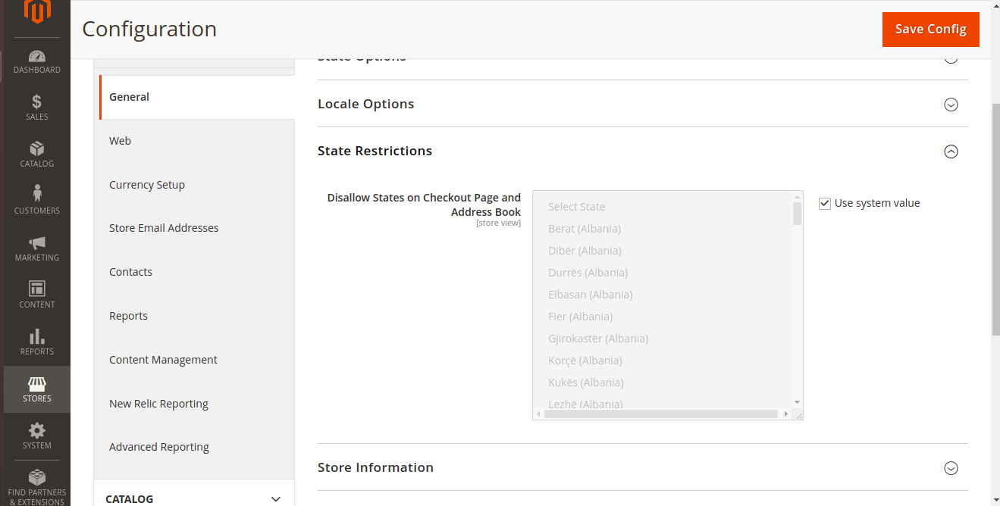
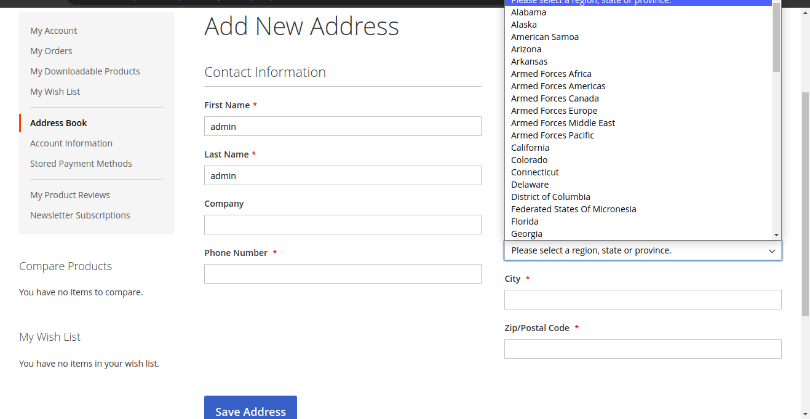
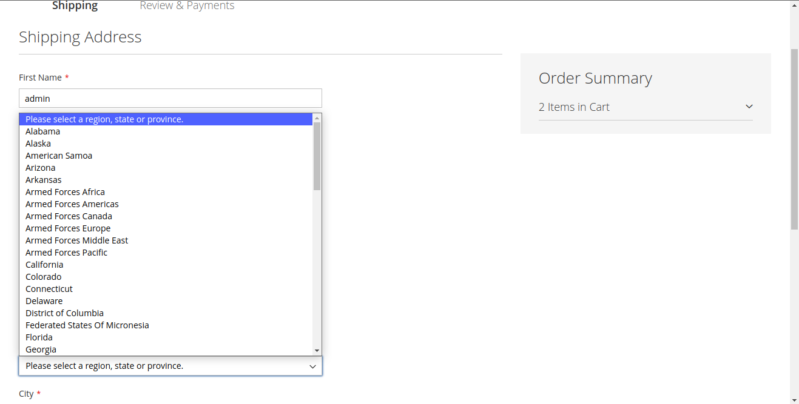
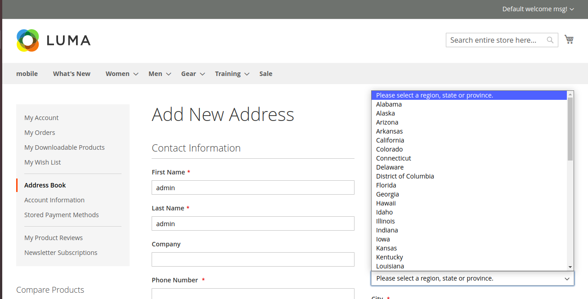
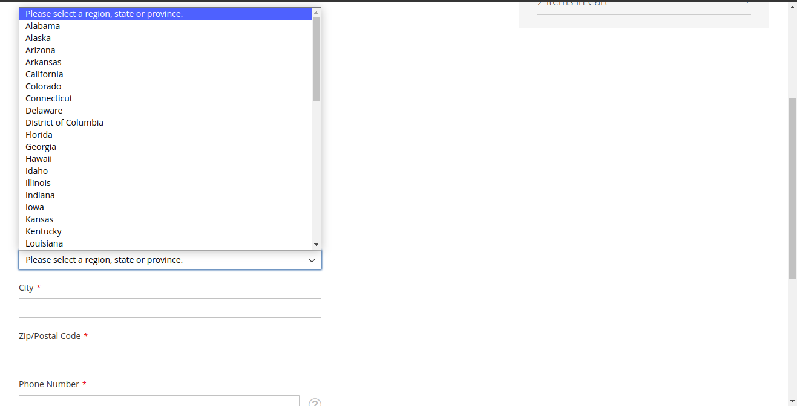

# Module Bluethink RestrictState

## Main Functionalities

- This module is used to remove states/provinces of any countires from the Region field on checkout and customer account section.

### Type 1: Zip file

- Enable the module by running `php bin/magento module:enable Bluethink_RestrictState`
- Apply database updates by running `php bin/magento setup:upgrade`
- Compilation by running `php bin/magento setup:di:compile`
- Static content deploy by running `php bin/magento setup:static-content:deploy`
- Flush the cache by running `php bin/magento cache:flush`

## Configuration

- For setting to remove states/provinces of any countires from the Region field. Go To (Magento Admin -> Stores -> Configuration -> General -> General -> State Restriction)

- Select the States you want to disallow and Save Config.

## Preview Before

- Address Book State/Provinces before setting saved

- Checkout Page State/Provinces before setting saved

## Preview After

- Address Book State/Provinces after setting saved

- Checkout Page State/Provinces after setting saved

